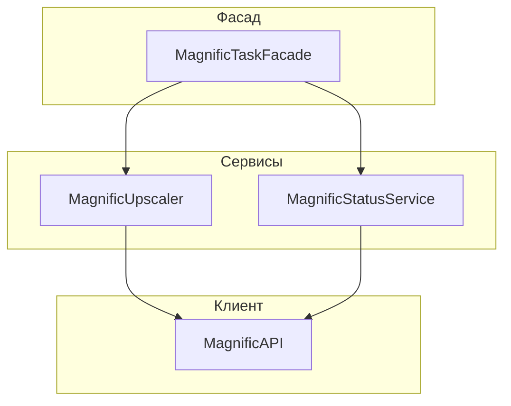

# Архитектура интеграции с Magnific (Freepik)

## Основные компоненты

- **MagnificAPI (client/api_client.py):** HTTP-клиент для работы с API, инкапсулирует обработку ошибок и логирование.
- **Протоколы (client/interfaces.py):** Описывают интерфейсы для сервисов (upscaler, status_service).
- **Сервисы (services/upscaler.py, services/status_service.py):** Реализации соответствующих протоколов, используют MagnificAPI для общения с API, содержат валидацию и логирование.
- **MagnificTaskFacade (facade/upscale_facade.py):** Универсальный фасад для работы с задачами Magnific (upscale, в будущем — другие задачи), реализует бизнес-логику и логику ожидания.
- **types.py:** Строгие типы (TypedDict, Literal) для структур данных.
- **magnific_task_factory.py (factory):** Фабрика для создания экземпляра фасада и всех зависимостей (поддерживает DI).

## Принципы архитектуры

- **Явное разделение ответственности:** Каждый сервис отвечает только за свою часть.
- **Dependency Injection:** Все зависимости передаются явно через параметры фабрики, что облегчает тестирование и расширение.
- **Строгая типизация:** Используются TypedDict и Literal для структур данных между слоями.
- **Фасад:** MagnificTaskFacade скрывает детали взаимодействия с API и сервисами.
- **Протоколы:** Позволяют легко подменять реализации для тестирования или расширения.
- **Логирование и обработка ошибок:** Все ключевые этапы логируются, ошибки обрабатываются централизованно.

## Пример использования

```python
from bot.factory.magnific_upscaler_factory import get_magnific_task_factory

# Получить сервис (можно передать свои реализации для тестов)
magnific_service = get_magnific_task_factory()

# Запустить задачу upscale изображения
result_url = await magnific_service.upscale_image(
    image=base64_image_str,
)
```

## Как расширять и тестировать

- Для подмены зависимостей (например, для тестов) используйте параметры фабрики:

```python
mock_upscaler = MyMockUpscaler()
magnific_service = get_magnific_task_factory(upscaler=mock_upscaler)
```

- Для новых типов задач добавьте TypedDict/Literal в types.py и расширьте соответствующие сервисы и фасад.

## Диаграмма архитектуры

