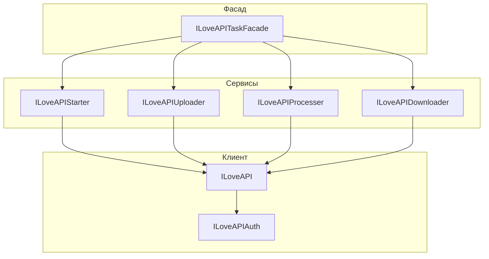

# Архитектура интеграции с ILoveAPI

## Основные компоненты

- **ILoveAPI (api_client.py):** HTTP-клиент для работы с API, инкапсулирует аутентификацию.
- **ILoveAPIAuth (auth.py):** Сервис для получения и хранения токена.
- **Протоколы (interfaces.py):** Описывают интерфейсы для загрузчика, скачивателя, процессора и стартера задач.
- **Сервисы (uploader.py, downloader.py, processer.py, starter.py):** Реализации соответствующих протоколов, используют ILoveAPI для общения с API.
- **ILoveAPITaskFacade (task_service.py):** Фасад для работы с задачами: объединяет стартер, загрузчик, процессор и скачиватель, реализует бизнес-логику.
- **validation.py:** Валидация и логирование шагов задач.
- **get_iloveapi_task_factory.py (factory):** Фабрика для создания экземпляра фасада и всех зависимостей (без синглтона, поддерживает DI).
- **types.py:** Строгие типы (TypedDict) для всех структур данных.

## Принципы архитектуры

- **Явное разделение ответственности:** Каждый сервис отвечает только за свою часть.
- **Dependency Injection:** Все зависимости передаются явно через параметры фабрики, что облегчает тестирование и расширение.
- **Строгая типизация:** Используются TypedDict для всех структур данных между слоями.
- **Фасад:** ILoveAPITaskFacade скрывает детали взаимодействия с API.
- **Протоколы:** Позволяют легко подменять реализации для тестирования или расширения.

## Пример использования

```python
from bot.factory.get_iloveapi_task_factory import get_iloveapi_task_factory

# Получить сервис (можно передать свои реализации для тестов)
iloveapi_service = get_iloveapi_task_factory()

# Запустить задачу изменения размера изображения
result = await iloveapi_service.resize_image(
    file=image_url,
    width=720,
    height=1280,
)
```

## Как расширять и тестировать

- Для подмены зависимостей (например, для тестов) используйте параметры фабрики:

```python
mock_uploader = MyMockUploader()
iloveapi_service = get_iloveapi_task_factory(uploader=mock_uploader)
```

- Для новых типов задач добавьте TypedDict в types.py и расширьте соответствующие сервисы.

## Диаграмма архитектуры

